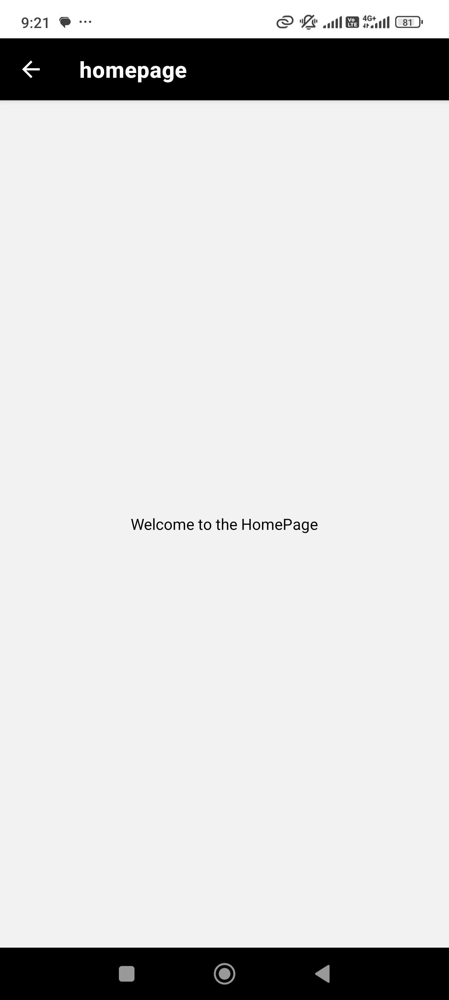

# Project Title

## Description
This project is a simple React Native application where I demonstrate self-introduction with an image. The app will navigate to the homepage after 10 seconds automatically. This README will guide you through the steps to replicate the application and show the result.

## Steps to Reproduce

### 1. **Setting Up the Environment**
- Make sure you have [Node.js](https://nodejs.org/en/) and [Expo CLI](https://docs.expo.dev/get-started/installation/) installed.
- Create a new Expo project using:
  ```bash
   npm install
   ```

- Start the app

   ```bash
    npx expo start
   ```

In the output, you'll find options to open the app in a

- [development build](https://docs.expo.dev/develop/development-builds/introduction/)
- [Android emulator](https://docs.expo.dev/workflow/android-studio-emulator/)
- [iOS simulator](https://docs.expo.dev/workflow/ios-simulator/)
- [Expo Go](https://expo.dev/go), a limited sandbox for trying out app development with Expo

You can start developing by editing the files inside the **app** directory. This project uses [file-based routing](https://docs.expo.dev/router/introduction).

## Get a fresh project

When you're ready, run:

```bash
npm run reset-project
```

This command will move the starter code to the **app-example** directory and create a blank **app** directory where you can start developing.

### 2. **Install Dependencies**

- npm install @react-navigation/native @react-navigation/stack react-native-screens react-native-safe-area-context

### 3. **Create Navigation Stack**

## Code

```javascript
import { Stack } from 'expo-router';

export default function RootLayout() {
  return (
    <Stack
      screenOptions={{
        headerStyle: {
          backgroundColor: '#000', // Black background for the header
        },
        headerTintColor: '#fff', // White text color for the header
        headerTitleStyle: {
          fontWeight: 'bold', // Bold font for the header title
        },
      }}
    >
      <Stack.Screen name="index" /> {/* Index screen */}
      <Stack.Screen name="homepage" /> {/* Homepage screen */}
    </Stack>
  );
}
```

### 4. **Index Screen**

### 5. **HomePage Screen**
